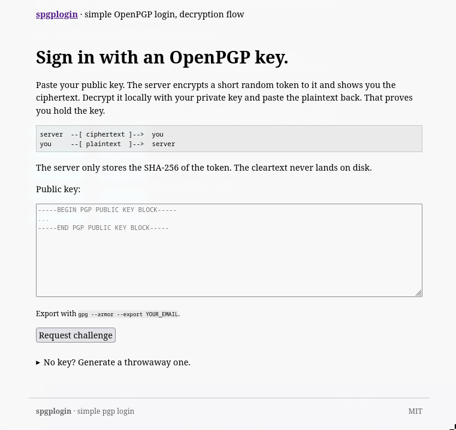

# pgplogin

Simple OpenPGP login for PHP. One file. No Composer, no PECL extension, no framework, no database. Decryption-challenge flow.



The user pastes a public key. The server encrypts a short random token to it. The user decrypts the ciphertext with their private key and pastes the plaintext back. The server compares its SHA-256 against what was encrypted. That's the whole protocol.

```
server  --[ ciphertext ]-->  you
you     --[ plaintext  ]-->  server
```

The cleartext token never persists. Only `sha256(token)` lives on the server, in whatever storage the host application chooses.

## Requirements

- PHP 8.1+
- `gpg` binary on the server (`apt install gnupg`, Alpine `apk add gnupg`, Homebrew `brew install gnupg`)

No PECL extensions. The library shells out to `gpg` via `proc_open`.

## Install

Download `pgplogin.php` into your project. That's it.

```bash
curl -O https://raw.githubusercontent.com/revmnds/pgplogin/main/pgplogin.php
# or just copy the file from this repo into your own
```

Then in your code:

```php
require_once 'pgplogin.php';
```

## Use

```php
require_once __DIR__.'/pgplogin.php';

$auth = new Pgplogin();

// 1. Issue a challenge.
$pending = $auth->issue($userPastedPublicKey);
//   $pending = array(
//     'fingerprint'     => '7f478825e9ed82dc0c7e7a0a04e012aaf271b92f',
//     'public_key'      => '-----BEGIN PGP PUBLIC KEY BLOCK----- ...',
//     'encrypted_token' => '-----BEGIN PGP MESSAGE----- ...',    // show this to the user
//     'token_hash'      => '15de2040e468...',                    // sha256
//     'issued_at'       => 1778611090,
//     'expires_at'      => 1778611390,
//   );
$_SESSION['pgp_pending'] = $pending;   // or DB, Redis, anywhere durable

// 2. Verify the plaintext the user pastes back.
try {
    $fingerprint = $auth->verify($_SESSION['pgp_pending'], $_POST['response']);
    unset($_SESSION['pgp_pending']);   // anti-replay: drop after success
    $_SESSION['user'] = $fingerprint;
} catch (PgploginException $e) {
    // expired, wrong plaintext, malformed input
    echo $e->getMessage();
}
```

That is the entire API. The constructor takes two optional arguments:

```php
new Pgplogin(
    $ttlSeconds = 300,            // challenge lifetime, default 5 min, min 30s
    $gpgBinary  = '/usr/bin/gpg'  // override if gpg isn't on PATH
);
```

There is also `$auth->inspect($publicKey)` which returns the fingerprint and capabilities without issuing a challenge, if you want to validate the key shape up front.

## What ends up in storage

| Field             | Contents                            |
| ----------------- | ----------------------------------- |
| `fingerprint`     | public, lowercase 40-hex            |
| `public_key`      | public, ASCII-armored               |
| `encrypted_token` | public (ciphertext to user)         |
| `token_hash`      | `sha256` of the cleartext           |
| `issued_at`       | unix timestamp                      |
| `expires_at`      | unix timestamp                      |

The cleartext token exists only inside `issue()` and is gone before the method returns. A leak of the session store does not let an attacker impersonate the user &mdash; they would need the private key to decrypt the ciphertext.

## Anti-replay

`verify()` does not delete the pending struct &mdash; the caller does:

```php
$fp = $auth->verify($pending, $response);
unset($_SESSION['pgp_pending']);   // do this
```

A second request with the same plaintext finds no pending challenge and is rejected.

## Framework recipes

### Laravel

Drop `pgplogin.php` into `app/Libraries/pgplogin.php` (or anywhere), then in the controller:

```php
namespace App\Http\Controllers;

require_once base_path('app/Libraries/pgplogin.php');

use App\Models\User;
use Illuminate\Http\Request;
use Illuminate\Support\Facades\Auth;

class PgpLoginController extends Controller
{
    public function issue(Request $request)
    {
        $request->validate(['public_key' => ['required', 'string', 'min:50', 'max:20000']]);

        try {
            $pending = (new \Pgplogin())->issue($request->input('public_key'));
        } catch (\PgploginException $e) {
            return back()->withErrors(['public_key' => $e->getMessage()])->withInput();
        }

        $request->session()->put('pgp_pending', $pending);
        return redirect()->route('login.verify');
    }

    public function verify(Request $request)
    {
        $request->validate(['response' => ['required', 'string', 'max:200']]);
        $pending = $request->session()->get('pgp_pending');
        if (! $pending) return redirect()->route('login');

        try {
            $fp = (new \Pgplogin())->verify($pending, $request->input('response'));
        } catch (\PgploginException $e) {
            return back()->withErrors(['response' => $e->getMessage()])->withInput();
        }

        $request->session()->forget('pgp_pending');
        $user = User::firstOrCreate(['fingerprint' => $fp]);
        Auth::login($user, remember: true);
        $request->session()->regenerate();

        return redirect()->intended(route('dashboard'));
    }
}
```

`Pgplogin` and `PgploginException` are in the global namespace, hence the leading `\`. If a global `require_once` in `bootstrap/app.php` feels cleaner, do that and drop the `require_once` from the controller.

### CodeIgniter 4

Put `pgplogin.php` in `app/ThirdParty/pgplogin.php`, then:

```php
namespace App\Controllers;

require_once APPPATH.'ThirdParty/pgplogin.php';

class PgpLogin extends BaseController
{
    public function start()
    {
        try {
            $pending = (new \Pgplogin())->issue($this->request->getPost('public_key'));
        } catch (\PgploginException $e) {
            return redirect()->back()->with('error', $e->getMessage());
        }
        session()->set('pgp_pending', $pending);
        return redirect()->to('/login/verify');
    }

    public function verify()
    {
        try {
            $fp = (new \Pgplogin())->verify(
                session('pgp_pending'),
                $this->request->getPost('response')
            );
        } catch (\PgploginException $e) {
            return redirect()->back()->with('error', $e->getMessage());
        }
        session()->remove('pgp_pending');
        session()->set('user_fingerprint', $fp);
        return redirect()->to('/dashboard');
    }
}
```

### Vanilla PHP

See [`example/index.php`](example/index.php) &mdash; the full flow in one file using native sessions.

## Run the demo

With Docker:

```bash
docker compose up --build
```

Or directly, if PHP 8.1+ and `gpg` are already installed:

```bash
php -S 127.0.0.1:8000 -t example
```

Open <http://127.0.0.1:8000>.

To generate a throwaway key for testing:

```bash
export GNUPGHOME=$(mktemp -d) && chmod 700 "$GNUPGHOME"
gpg --batch --pinentry-mode loopback --passphrase "" \
    --quick-generate-key "demo <demo@example.com>" default default 1y
gpg --armor --export demo
```

Paste that public key into the form. On the next page, decrypt the ciphertext you see and paste back the plaintext.

## Limitations

- Not phishing-resistant. The user is decrypting opaque ciphertext; a hostile site can relay challenges from a real one. If you need phishing-resistance, sign a domain-bound message instead.
- Not a user store. The library says "this request came from the holder of fingerprint X." Mapping X to an account is the host application's responsibility.
- Lose the key, lose the account. No recovery is built in.
- Fingerprints are stable identifiers. Reusing one key across services makes accounts correlatable.

## License

MIT.
